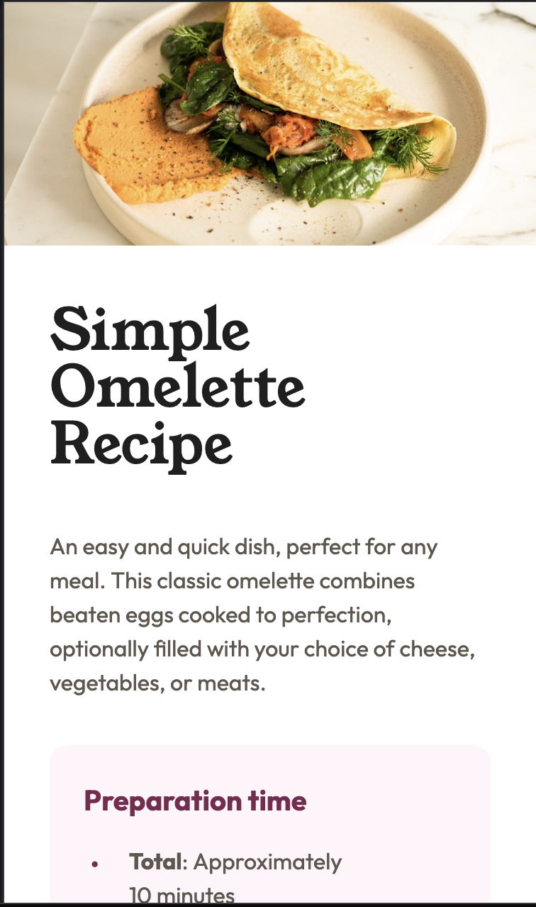
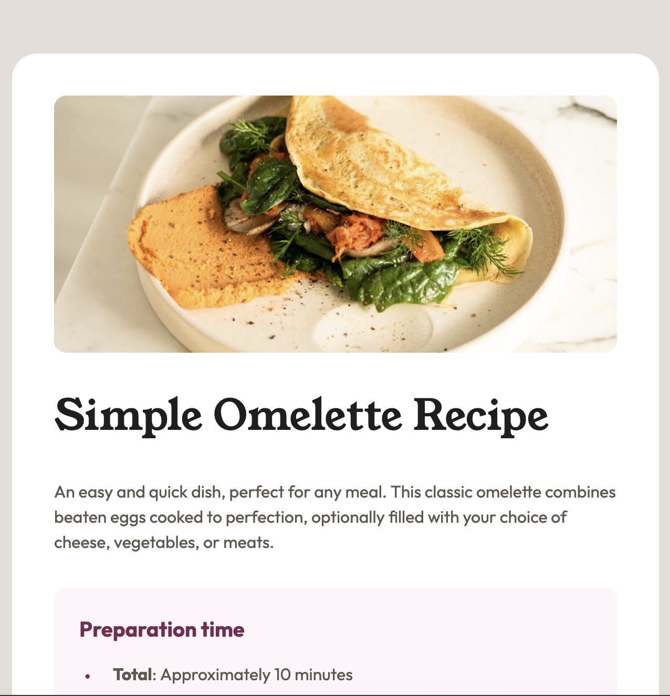
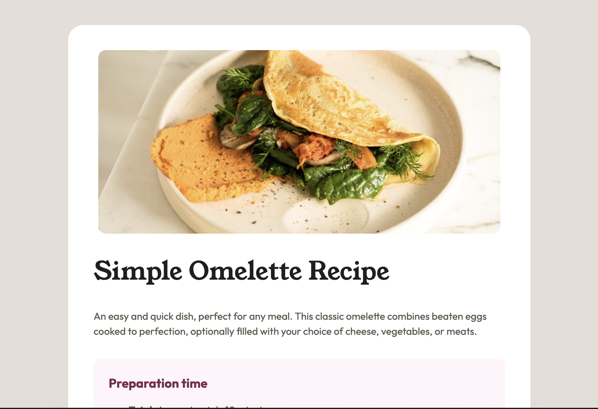

# Recipe page

This is a solution to the [Recipe page challenge on Frontend Mentor](https://www.frontendmentor.io/challenges/recipe-page-KiTsR8QQKm).

## Table of Contents

- [Overview](#overview)
  - [The challenge](#the-challenge)
  - [Screenshot](#screenshot)
  - [Links](#links)
- [My process](#my-process)
  - [Built with](#built-with)
  - [What I learned](#what-i-learned)
  - [Continued Development](#continued-development)
  - [Useful resources](#useful-resources)
- [Author](#author)

## Overview

### The challenge

Your challenge is to build out this recipe page and get it looking as close to the design as possible.

You can use any tools you like to help you complete the challenge. So if you've got something you'd like to practice, feel free to give it a go.

### Screenshot

Mobile view

Tablet view

Desktop view

### Links

- Github Repo URL: [Recipe Page Repo](https://github.com/amyspencerproject/fe-recipe-page)
- Live Site URL: [Recipe Page](https://amyspencerproject.github.io/fe-recipe-page/)

## My process

### Built with

- Semantic HTML5 markup
- CSS Variables
- Mobile-first workflow

### What I learned

Attempted to use `<th>` in the Nutrituion table even though the design does not use a tradtional table and therefore not a column heading. I thought this would be good for accessiblity and maybe helpful for styling. By using a tag of `role="row"` I got the `<th>` to act as a row not a column. When I first submitted my solution I got the following feedback.

"The element <th role="row"> is using an ARIA role that requires specific child elements to maintain semantic structure and accessibility. The row role must contain elements with the columnheader or rowheader roles as children, but here it’s applied directly to a <th> without the required children. This breaks the expected accessibility tree, confusing assistive technologies."

I made the accessibility worse by with my solution.

### Continued development

Maybe try using gap since all the elements will be spaced the same. Here is a [discord thread](https://canary.discord.com/channels/824970620529279006/1410499692571394118) about when to use gap or margins

### Useful resources

- [List Marker Spacing](https://css-tricks.com/everything-you-need-to-know-about-the-gap-after-the-list-marker/) - Everything you ever wanted to know about the gap after the list marker

## Author

- Website - [Amy Spencer](https://spencerproject.com/)
- Frontend Mentor - [@amyspencerproject](https://www.frontendmentor.io/profile/amyspencerproject)
- Linkedin - [amyspencercodes](https://www.linkedin.com/in/amyspencercodes/)
